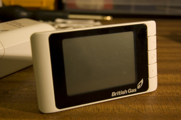
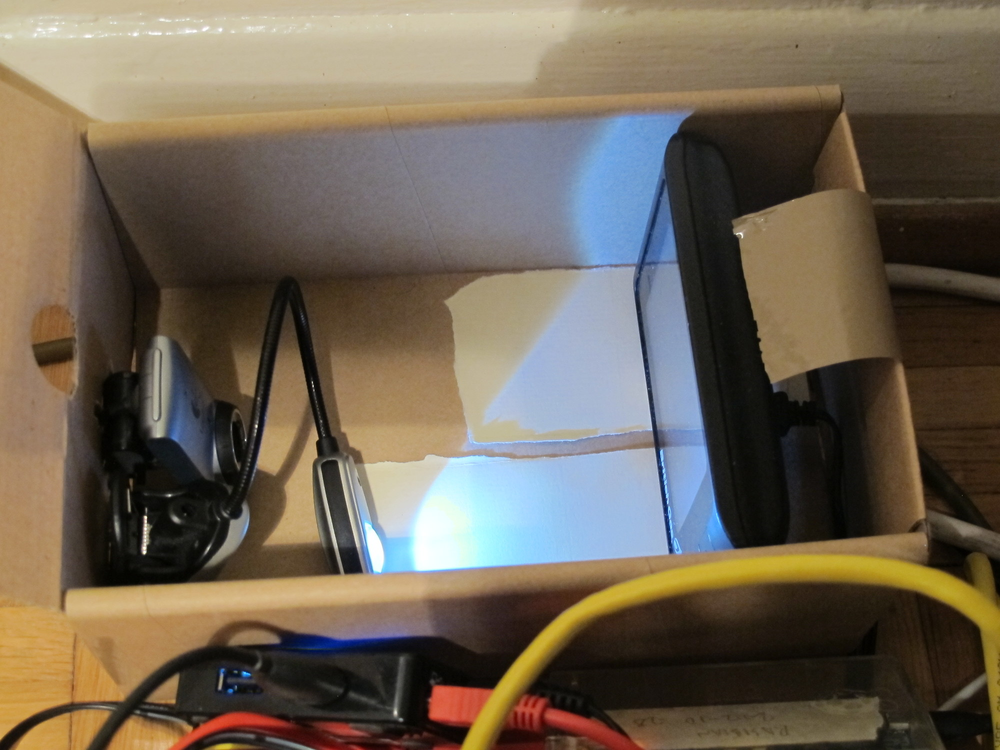
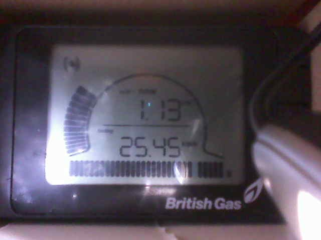
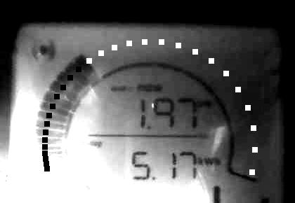

# Reading the GEO Minim energy meter with a webcam & Python

Unfortunately the GEO Minim energy meter doesn't allow you to easily fetch the
data from meter with a computer. This is bad because it means we can't easily
log the data or do [anything](http://cursivedata.co.uk) [interesting](https://github.com/mattvenn/energy-wristband) with it.

I was in a position where I really wanted to do energy logging with one of
these meters. Here is a Python program that takes a photo, processes it, then
reads the 'speedometer' bar graph from the meter, and returns the current energy
usage in Watts.

# Setup (and computer vision tips)

## Build your enclosure

It's super important to control the photo environment of the meter, webcam and
light. This makes it a lot easier to do the image processing afterwards. And in
my limited experience, the easier that is the better!

I ended up also adding some crumpled silver foil and some translucent plastic to
try to minimize glare from the light.

Also make sure that the meter, light and camera are securely fixed in the box.
We're keeping it simple and relying on the meter's position in the box not
changing between shots.

## Run the program

* Install the requirements (below)
* Connect the webcam
* Run the program `python read_minim.py`
* Tune the program till it works with your enclosure, light and webcam.

## Photos and processing

Here's the raw photo that I get (saved as meter.jpg by the program)

After the processing, (if successful) you'll have an image that shows the result
of the image processing:

The black dots show where the program thinks the bar is lit, and the white ones
are where it thinks the bar is not lit.

If this doesn't work, you'll need to do some tuning...

## Tuning

Try changing the `sens` variable (default 20). This sets the difference in
brightness needed for the program to think the bar graph segment has gone from
lit to non lit.

Try changing the exposure and brightness settings in the webcam function
`take_photo()`

Change the log level line

    logging.basicConfig(level=logging.INFO)

from INFO to DEBUG to get lots more debugging info

# Requirements

* easyprocess Python package
* PIL Python package
* fswebcam

# Notes & Resources

* [GEO Minim Manual](http://www.greenenergyoptions.co.uk/assets/media/instruction-manuals/geominim.pdf)
* [Teardown of the minim](http://diary.piku.org.uk/2009/12/03/british-gas-energysmart-energy-meter-teardown/)
* A [program that can read a 7 segment display](https://www.unix-ag.uni-kl.de/~auerswal/ssocr/) - didn't work for me
* Interesting [paper](http://www.ski.org/Rehab/HShen/Publications/embedded.pdf) about reading 7 segment displays with a cell phone
